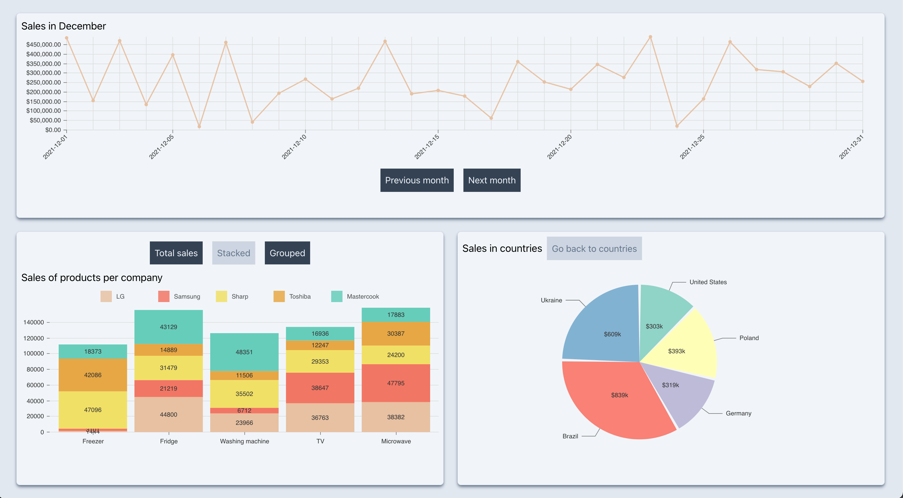
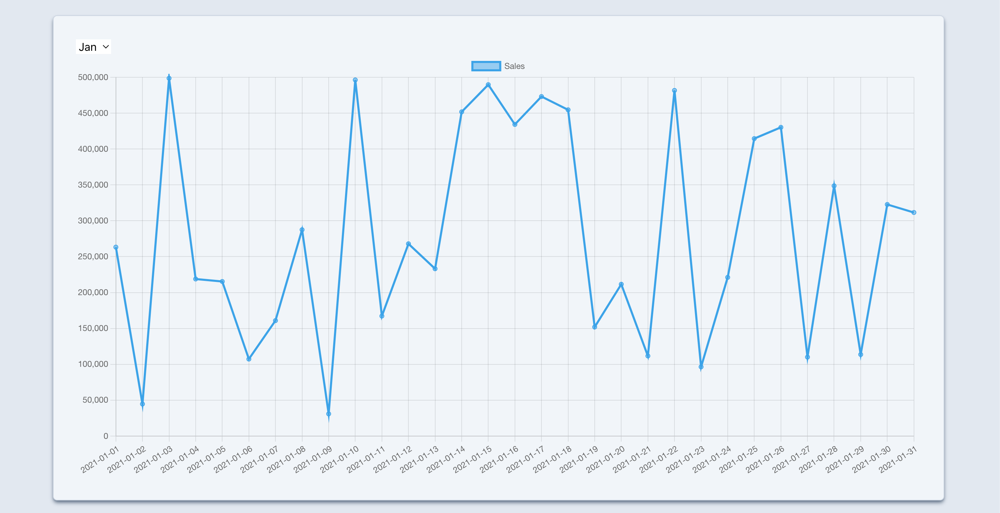
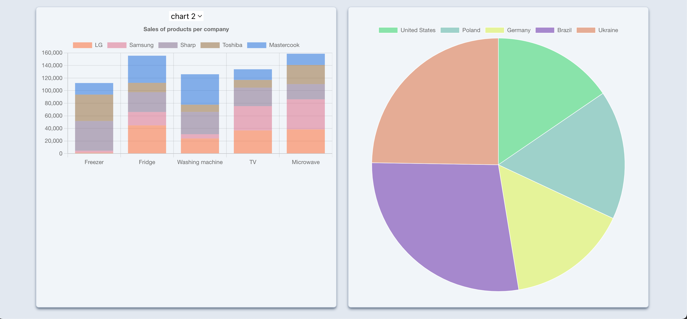
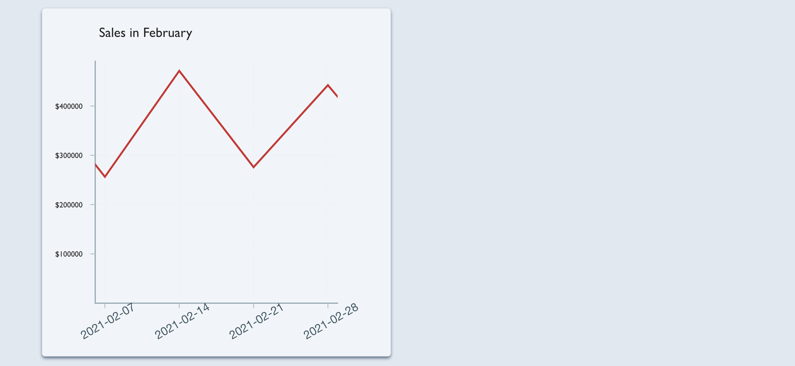
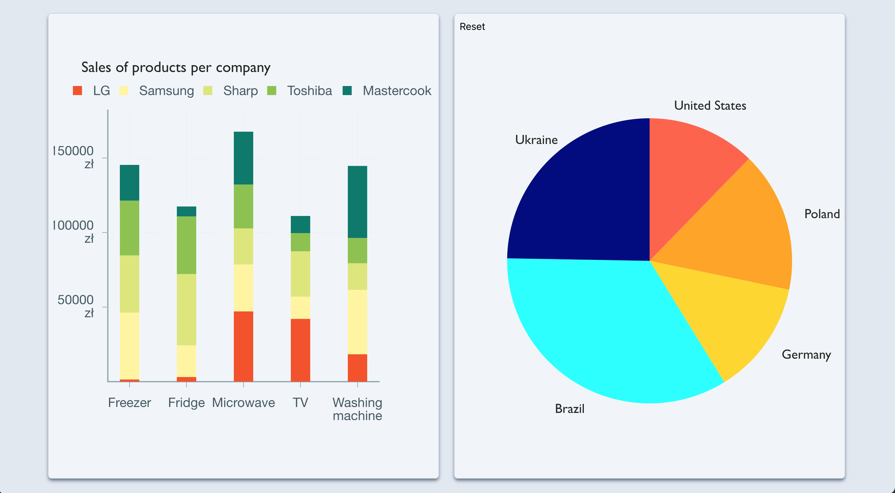
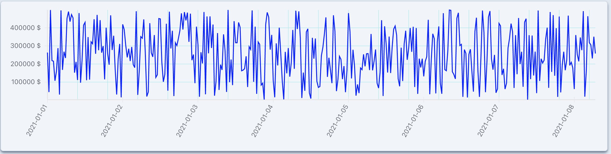
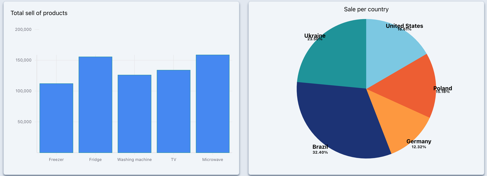

## Results

### [Nivo charts](https://nivo.rocks/)

Result:

Team opinion:

- **Documentation quality:** really nice, with live playground for every option
- **Ease of use:** easy to setup and configure for most cases 
- **Customisation capabilities (features & styling):** many options, and allows passing custom elements for tooltips etc. but if you need something else, then it might be impossible to implement. Css styles can be added to only certain elements. 
- **Features that might be hard to implement:**
  - sizing of the chart can be defined only in absolute pixel values making it hard to adjust based on screen size etc.
  - we haven't found support for custom animations

### [React chartjs 2](https://react-chartjs-2.js.org/)

Result:

Team opinion:

- Advantages 
  - Readable documentation with examples 
  - Easy to use 
  - Built-in animations and functions 
  - Many customisation option (with plugins)

- Disadvantages 
  - Small number of chart types

### [Victory](https://formidable.com/open-source/victory/)

Result:

Team opinion:

- Advantages
  - it works :)

- Disadvantages
  - small number of chart types
  - old documentation, with class components
  - poorly described functionalities
  - things that should be easy aren't (like changing data after click)

### [React-vis](https://uber.github.io/react-vis/)

Result:

Team opinion:

- Advantages
  - it works :)

- Disadvantages
  - Documentation is not really well-written, lack of complex examples, a bit messy.
  - Quite hard to use compared to power it offers, creating even simple charts requires lots of work and going through several documentation pages.
  - Barely customisable. Lack of commonly used features e.g. changing styles on hovered dataset or chart part.
  - Decorative elements like legends, infos, fancy labels.
